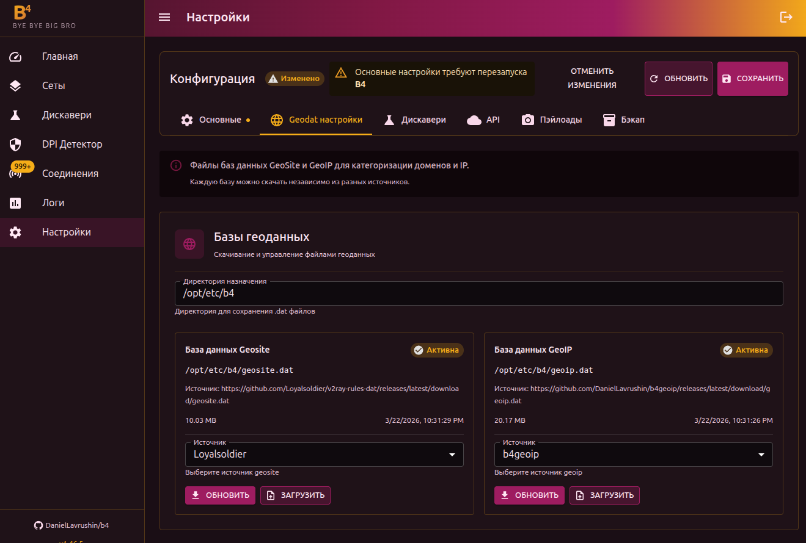

# Геоданные

Базы `GeoSite` и `GeoIP` позволяют настраивать обход для целых категорий сайтов и IP-диапазонов вместо добавления доменов по одному.

## GeoSite

База доменов, сгруппированных по категориям (youtube, discord, google, facebook и т.д.). Формат V2Ray.

### Настройка

1. Перейдите в **Настройки → Geodat настройки**
2. Укажите **Директорию назначения** (по умолчанию `/etc/b4`)
3. Выберите источник из выпадающего списка или укажите URL вручную
4. Нажмите **Скачать**

Статус отображается как **Active** (файл найден) или **Not Found**.

Можно загрузить `.dat` файл вручную через кнопку загрузки.

## GeoIP

База IP-диапазонов по странам и ASN. Настраивается аналогично GeoSite.

## Использование

После загрузки баз данных категории становятся доступны в настройках сетов:

- **Цели → Категории GeoSite** — выбрать категории доменов
- **Цели → Категории GeoIP** — выбрать категории IP

